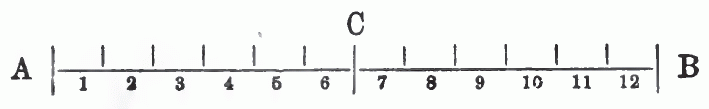
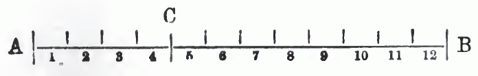

::: {.parallel-container}

::: {.parallel-col-de}

```{=html}
<p class="fst">Ist die nothwendige Arbeitszeit, das heißt der Theil des Arbeitstages, während dessen nur so viel Werth produzirt wird, als das Kapital für die Waare Arbeitskraft zu erlegen hat, eine bestimmte Größe, dann kann die Rate des Mehrwerthes nur vergrößert werden durch <em>Verlängerung des Arbeitstages.</em> Beträgt z. B. die nothwendige Arbeitszeit 6 Stunden täglich, und ist sie unveränderlich, was unter gegebenen Produktionsbedingungen der Fall, dann kann die Rate des Mehrwerthes nur vermehrt werden durch Verlängerung des Arbeitstages.</p>
```

:::

::: {.parallel-col-en}

```{=html}
<p class="fst">If the necessary labour-time, that is, the part of the working day during which only as much value is produced as capital has to pay out for the commodity labour-power, is a definite magnitude, then the rate of surplus value can be increased only by <em>lengthening the working day.</em> If, for example, the necessary labour-time amounts to 6 hours daily, and it is unalterable—which is the case under given conditions of production—then the rate of surplus value can be increased only by lengthening the working day.</p>
```

:::

:::

::: {.parallel-container}

::: {.parallel-col-de}

```{=html}
<p>Die Wirkungen dieses Umstandes haben wir im 4. Kapitel betrachtet.</p>
```

:::

::: {.parallel-col-en}

```{=html}
<p>We considered the effects of this circumstance in the 4th chapter.</p>
```

:::

:::

::: {.parallel-container}

::: {.parallel-col-de}

```{=html}
<p>Aber der Arbeitstag kann nicht in’s Unendliche ausgedehnt werden. Das Bestreben des Kapitalisten, ihn zu verlängern, findet <em>natürliche</em> Schranken in der Erschöpfung des Arbeiters, <em>moralische</em> Schranken in dessen Ansprechen auf freie Bethätigung als Mensch, <em>politische</em> Schranken in der durch verschiedene Verhältnisse erzwungenen Beschränkung des Arbeitstages durch den Staat. Nehmen wir an, der Arbeitstag habe eine Grenze erlangt, über die er unter den gegebenen Umständen nicht verlängert werden könne; diese Grenze sei mit der zwölften Arbeitsstunde gegeben. Die nothwendige Arbeitszeit betrage sechs Stunden, die Rate des Mehrwerthes also 100 Prozent.</p>
```

:::

::: {.parallel-col-en}

```{=html}
<p>But the working day cannot be extended to infinity. The capitalist's endeavour to lengthen it finds <em>natural</em> barriers in the exhaustion of the worker, <em>moral</em> barriers in his claim to free activity as a human being, and <em>political</em> barriers in the limitation of the working day by the state, enforced by various circumstances. Let us assume that the working day has reached a limit beyond which, under the given circumstances, it cannot be extended; let this limit be set at the twelfth hour of labour. Let the necessary labour-time amount to six hours, and thus the rate of surplus value to 100 per cent.</p>
```

:::

:::

::: {.parallel-container}

::: {.parallel-col-de}

```{=html}
<p>Wie nun diese Rate vergrößern? Sehr einfach. Drücke ich die nothwendige Arbeitszeit von 6 auf 4 Stunden herab, so steigt die Zeit der Mehrarbeit von 6 auf 8 Stunden; die <em>Länge</em> des Arbeitstages ist die gleiche geblieben, aber das <em>Verhältniß</em> seiner beiden Bestandtheile, der <em>nothwendigen</em> und der <em>überschüssigen</em> Arbeitszeit, ist ein anderes geworden. Damit auch die Rate des Mehrwerthes. Durch die Herabdrückung der nothwendigen Arbeitszeit von 6 auf 4 Stunden bei 12stündigem Arbeitstag ist die Rate des Mehrwerthes von 100 auf 200 Prozent gestiegen, <em>sie hat sich verdoppelt.</em> Der Vorgang wird am leichtesten begriffen, wenn man die Länge des Arbeitstages und seiner Theile in Linien von gewisser Länge veranschaulicht. Nehmen wir au, die Linie <em>A—B</em> stelle einen zwölf stündigen Arbeitstag vor, der Linientheil <em>A—C</em> die nothwendige, der Theil <em>C—B</em> die überschüssige Arbeitszeit:</p>
```

:::

::: {.parallel-col-en}

```{=html}
<p>Now, how is this rate to be increased? Very simply. If I force the necessary labour-time down from 6 to 4 hours, then the time of surplus labour rises from 6 to 8 hours; the <em>length</em> of the working day has remained the same, but the <em>relation</em> of its two component parts, the <em>necessary</em> and the <em>surplus</em> labour-time, has become a different one. And with it the rate of surplus value. Through the forcing-down of the necessary labour-time from 6 to 4 hours, with a 12-hour working day, the rate of surplus value has risen from 100 to 200 per cent; <em>it has doubled.</em> The process is most easily grasped when one illustrates the length of the working day and its parts by lines of a certain length. Let us assume that the line <em>A—B</em> represents a twelve-hour working day, the line-segment <em>A—C</em> the necessary, and the segment <em>C—B</em> the surplus labour-time:</p>
```

:::

:::

::: {.table-block}

```{=html}
<div class="table-scroll">
<p class="c"></p>
</div>
<div class="table-scroll">
<p class="c"></p>
</div>
```

:::

::: {.parallel-container}

::: {.parallel-col-de}

```{=html}
<p>Wie kann ich <em>C—B</em> um zwei Längseinheiten, die Arbeitsstunden darstellen, verlängern, ohne <em>A—B</em> auszudehnen? Durch Verkürzung von <em>A—C:</em></p>
```

:::

::: {.parallel-col-en}

```{=html}
<p>How can I lengthen <em>C—B</em> by two units of length, which represent hours of labour, without extending <em>A—B</em>? By shortening <em>A—C:</em></p>
```

:::

:::

::: {.table-block}

```{=html}
<div class="table-scroll">
<p class="c"></p>
</div>
<div class="table-scroll">
<p class="c"></p>
</div>
```

:::

::: {.parallel-container}

::: {.parallel-col-de}

```{=html}
<p><em>C—B</em> auf der ersten Linie ist ebenso groß wie <em>A—C.</em> Auf der zweiten ist <em>C—B</em> noch einmal so groß als <em>A—C.</em></p>
```

:::

::: {.parallel-col-en}

```{=html}
<p><em>C—B</em> on the first line is just as large as <em>A—C.</em> On the second, <em>C—B</em> is twice as large as <em>A—C.</em></p>
```

:::

:::

::: {.parallel-container}

::: {.parallel-col-de}

```{=html}
<p>Es ist also möglich, Mehrwerth zu erzielen nicht nur durch <em>absolute Verlängerung des Arbeitstages,</em> sondern auch durch <em>Verkürzung der nothwendigen Arbeitszeit.</em></p>
```

:::

::: {.parallel-col-en}

```{=html}
<p>It is therefore possible to obtain surplus value not only through the <em>absolute lengthening of the working day,</em> but also through the <em>shortening of the necessary labour-time.</em></p>
```

:::

:::

::: {.parallel-container}

::: {.parallel-col-de}

```{=html}
<p>Durch Verlängerung des Arbeitstages produzirten Mehrwerth nennt Marx <em>absoluten Mehrwerth;</em> den Mehrwerth dagegen, der aus Verkürzung der nothwendigen Arbeitszeit und entsprechender Veränderung im Größenverhältniß der beiden Bestandtheile des Arbeitstages entspringt, <em>relativen Mehrwerth.</em></p>
```

:::

::: {.parallel-col-en}

```{=html}
<p>Surplus value produced by lengthening the working day Marx calls <em>absolute surplus value;</em> the surplus value, on the other hand, which arises from the shortening of the necessary labour-time and the corresponding change in the proportional magnitude of the two component parts of the working day, he calls <em>relative surplus value.</em></p>
```

:::

:::

::: {.parallel-container}

::: {.parallel-col-de}

```{=html}
<p>In unverhüllter Form zeigt sich das Bestreben des Kapitalisten, den Mehrwerth in letzterer Weise zu vergrößern, in seinen Versuchen, den Lohn zu drücken. Da aber der Werth der Arbeitskraft unter gegebenen Verhältnissen eine bestimmte Größe ist, kann dies Bestreben nur dahin gehen, den <em>Preis</em> der Arbeitskraft <em>unter ihren Werth herabzudrücken.</em> So wichtig dieser Umstand in der Praxis ist, so können wir ihn doch hier noch nicht näher berücksichtigen, wo es sich um die <em>Grundlagen</em> der ökonomischen Bewegung, nicht um ihre <em>äußerlichen Erscheinungsformen</em> handelt.</p>
```

:::

::: {.parallel-col-en}

```{=html}
<p>In undisguised form, the capitalist's endeavour to increase surplus value in the latter manner shows itself in his attempts to depress wages. But since the value of labour-power is, under given conditions, a definite magnitude, this endeavour can only aim at forcing the <em>price</em> of labour-power <em>down below its value.</em> As important as this circumstance is in practice, we cannot yet take it into closer consideration here, where it is a matter of the <em>foundations</em> of the economic movement, not of its <em>external forms of appearance.</em></p>
```

:::

:::

::: {.parallel-container}

::: {.parallel-col-de}

```{=html}
<p>Wir müssen daher vorläufig von der Annahme ausgehen, daß Alles normal vor sich geht, der Preis dem Werth entspricht, also der Lohn der Arbeitskraft ihrem Werth. Wir haben hier also noch nicht zu untersuchen, wie der Arbeitslohn unter den Werth der Arbeitskraft gedrückt werden kann und welche Folgen dies mit sich führt, sondern zu untersuchen, wie der <em>Werth</em> der Arbeitskraft verringert wird.</p>
```

:::

::: {.parallel-col-en}

```{=html}
<p>We must therefore, for the time being, proceed from the assumption that everything goes on normally, that the price corresponds to the value, and thus the wage of labour-power to its value. Here, then, we have not yet to investigate how the wage of labour can be forced down below the value of labour-power and what consequences this entails, but rather to investigate how the <em>value</em> of labour-power is reduced.</p>
```

:::

:::

::: {.parallel-container}

::: {.parallel-col-de}

```{=html}
<p>Der Arbeiter hat unter gegebenen Umständen bestimmte Bedürfnisse; er bedarf zu seiner und seiner Familie Erhaltung einer bestimmten Menge von <em>Gebrauchswerthen.</em> Diese Gebrauchsgegenstände sind Waaren, ihr Werth wird bedingt durch die zu ihrer Herstellung gesellschaftlich nothwendige Arbeitszeit. Das ist uns Alles bereits bekannt, es bedarf nicht weiterer Ausführung. Sinkt die zur Herstellung der erwähnten Gebrauchsgegenstände durchschnittlich nothwendige Arbeitszeit, so sinkt auch der Werth dieser Produkte und damit der Werth der Arbeitskraft des Arbeiters und der zur Wiederherstellung dieses Werthes nothwendige Theil des Arbeitstages, ohne Einschränkung der gewohnheitsgemäßen Bedürfnisse des Arbeiters. Mit anderen Worten: <em>steigt die Produktivkraft der Arbeit, so sinkt unter gewissen Umständen der Werth der Arbeitskraft.</em> Nur unter gewissen Umständen, nämlich nur dann oder nur insoweit, als die Erhöhung der Produktivkraft der Arbeit die Arbeitszeit verkürzt, die nothwendig ist zur Herstellung der Lebensmittel, deren der Arbeiter gewohnheitsmäßig bedarf. Wenn der Arbeiter gewohnt ist, Stiefel zu tragen, anstatt barfuß zu gehen, so wird es den Werth der Arbeitskraft verringern, wenn zur Herstellung eines Paars Stiefel 6 statt 12 Arbeitsstunden nothwendig sind. Wenn aber die Produktivkraft der Arbeit der Diamantenschleifer oder der Spitzenklöppler sich verdoppelt, so bleibt dies auf den Werth der Arbeitskraft ohne Einfluß.</p>
```

:::

::: {.parallel-col-en}

```{=html}
<p>Under given circumstances the worker has definite needs; for the maintenance of himself and his family he requires a definite quantity of <em>use-values.</em> These objects of use are commodities, their value is determined by the labour-time socially necessary for their production. All this is already known to us; it requires no further exposition. If the labour-time on average necessary for the production of the mentioned objects of use falls, then the value of these products also falls, and with it the value of the worker's labour-power and the part of the working day necessary for the reproduction of this value, without any restriction of the worker's customary needs. In other words: <em>if the productive power of labour rises, then under certain circumstances the value of labour-power falls.</em> Only under certain circumstances, namely only then or only in so far as the increase of the productive power of labour shortens the labour-time that is necessary for the production of the means of subsistence which the worker customarily requires. If the worker is accustomed to wearing boots instead of going barefoot, then it will reduce the value of labour-power if for the production of a pair of boots 6 instead of 12 hours of labour are necessary. But if the productive power of the labour of diamond-cutters or lace-makers doubles, this remains without influence on the value of labour-power.</p>
```

:::

:::

::: {.parallel-container}

::: {.parallel-col-de}

```{=html}
<p>Eine Erhöhung der Produktivkraft der Arbeit ist aber nur möglich durch eine <em>Aenderung des Produktionsverfahrens,</em> durch eine Verbesserung der Arbeitsmittel oder der Arbeitsmethoden. <em>Die Produktion von relativem Mehrwerth wird also bedingt durch eine Umwälzung des Arbeitsverfahrens.</em></p>
```

:::

::: {.parallel-col-en}

```{=html}
<p>An increase in the productive power of labour is, however, only possible through a <em>change in the method of production,</em> through an improvement of the means of labour or of the methods of labour. <em>The production of relative surplus value is therefore conditioned by a revolution in the method of labour.</em></p>
```

:::

:::

::: {.parallel-container}

::: {.parallel-col-de}

```{=html}
<p>Diese Umwälzung und stete Vervollkommnung der Produktionsweise ist eine Naturnothwendigkeit für das kapitalistische Produktionssystem. Der einzelne Kapitalist wird sich dessen freilich nicht nothwendig bewußt, daß, je wohlfeiler er produzirt, desto niedriger der Werth der Arbeitskraft und desto höher, unter sonst gleichen Umständen, der Mehrwerth. Die Konkurrenz zwingt ihn aber stets zu neuen Verbesserungen im Produktionsprozeß. Das Bestreben, seinen Konkurrenten zuvor zu kommen, bewegt ihn, Methoden einzuführen, die ihm erlauben, in geringerer, als der durchschnittlich nothwendigen Arbeitszeit ebensoviel Waaren zu erzeugen, wie bisher. Die Konkurrenz zwingt seine Konkurrenten, das verbesserte Verfahren ebenfalls einzuführen. Die Ausnahmsgewinne, die gemacht worden, so lange es vereinzelt gewesen, schwinden, sobald es allgemein geworden, aber, je nach dem dies Verfahren auf die Produktion der nothwendigen Lebens mittel mehr oder weniger einwirkt, bleibt als <em>dauerndes</em> Ergebniß eine mehr oder weniger große Senkung des Werthes der Arbeitskraft und eine entsprechende Steigerung des relativen Mehrwerthes.</p>
```

:::

::: {.parallel-col-en}

```{=html}
<p>This revolution and constant perfecting of the mode of production is a natural necessity for the capitalist system of production. The individual capitalist, to be sure, does not necessarily become conscious of the fact that the more cheaply he produces, the lower the value of labour-power and, other circumstances being equal, the higher the surplus value. But competition constantly compels him to make new improvements in the production process. The endeavour to get ahead of his competitors moves him to introduce methods that allow him to produce just as many commodities as before in a labour-time smaller than the average necessary one. Competition compels his competitors to introduce the improved method as well. The exceptional profits that were made so long as it was isolated vanish as soon as it has become general, but, according as this method affects the production of the necessary means of subsistence more or less, there remains as a <em>lasting</em> result a more or less great lowering of the value of labour-power and a corresponding rise of relative surplus value.</p>
```

:::

:::

::: {.parallel-container}

::: {.parallel-col-de}

```{=html}
<p>Dies nur eine der Ursachen, welche bewirken, daß der Kapitalismus die Produktionsweise beständig umwälzt und so den relativen Mehrwerth immer mehr erhöht. Steigt die Produktivkraft der Arbeit, so steigt auch die Rate des relativen Mehrwerthes, während der Werth der produzirten Waaren entsprechend sinkt. So sehen wir den anscheinenden Widerspruch sich entwickeln, daß die Kapitalisten unablässig bemüht sind, immer billiger zu produziren, ihren Waaren immer geringeren Werth zu geben, um immer mehr Werth einsacken zu können. Wir sehen aber noch eine andere anscheinende Ungereimtheit auftauchen: je größer die Produktivität der Arbeit, desto größer unter der Herrschaft der kapitalistischen Produktionsweise die Mehrarbeit, die überschüssige Arbeitszeit des Arbeiters. Die kapitalistische Produktionsweise strebt darnach, die Produktivkraft der Arbeit riesenhaft zu steigern, die nothwendige Arbeitszeit auf ein Minimum zu verringern, gleichzeitig aber den Arbeitstag so viel als möglich zu verlängern.</p>
```

:::

::: {.parallel-col-en}

```{=html}
<p>This is but one of the causes which bring it about that capitalism constantly revolutionises the mode of production and thus raises the relative surplus value ever more. If the productive power of labour rises, then the rate of relative surplus value also rises, while the value of the commodities produced falls correspondingly. Thus we see the apparent contradiction develop, that the capitalists strive incessantly to produce ever more cheaply, to give their commodities an ever smaller value, in order to be able to pocket ever more value. But we see yet another apparent absurdity arise: the greater the productivity of labour, the greater, under the domination of the capitalist mode of production, is the surplus labour, the excess labour-time of the worker. The capitalist mode of production strives to increase the productive power of labour enormously, to reduce the necessary labour-time to a minimum, but at the same time to lengthen the working day as much as possible.</p>
```

:::

:::

::: {.parallel-container}

::: {.parallel-col-de}

```{=html}
<p>Wie sie den Arbeitstag verlängerte, haben wir bereits im vierten Kapitel gesehen. Betrachten wir jetzt, wie sie die nothwendige Arbeitszeit verkürzte.</p>
```

:::

::: {.parallel-col-en}

```{=html}
<p>How it lengthened the working day we have already seen in the fourth chapter. Let us now consider how it shortened the necessary labour-time.</p>
```

:::

:::

